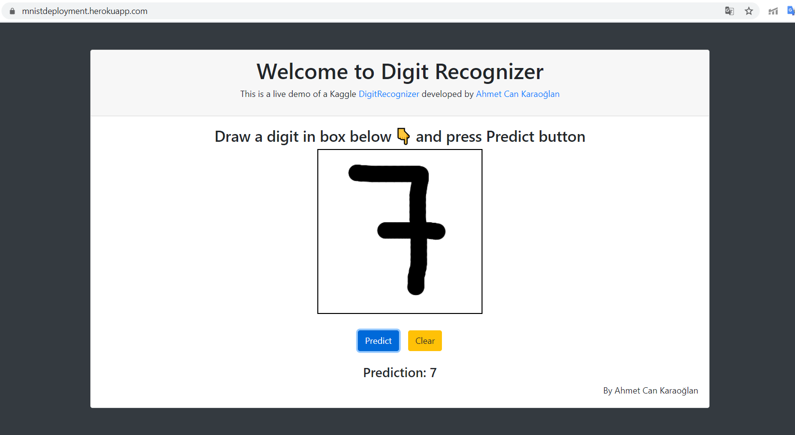

# DigitClassifier

## Project Link(Deployed on *Heroku*):
https://mnistdeployment.herokuapp.com/

### Aim
This project aims to recognize a digit that is drawn on the canvas provided.

### How to use?

1. Clone the repository
2. Install the required packages in "requirements.txt" file. 

Some packages are:

- numpy
- pandas
- tensorflow

3. Run the "application.py" file

### Run
The prediction time for the first digit can take upto 20 secs(Happens mainly because the model is loading). But subsequently the prediction time reduces greatly.

### Description
The model was trained on the famous MNIST Dataset. There are two parts to this project: Model Training and Model Deployment.

#### Model Training

Link for Google Colab file where the model was trained: https://colab.research.google.com/drive/1_wvukMlBHb9Q987vILxWbEHybnTF77t-

Training Process:

1. Train Test Split( test_size: 0.4 )
2. Normalized Training Data and reshape to (number of images,28,28,1)
3. Image Augumentation to generate augumented data 8 times the training data. Total training data becomes 9 times. 
4. Defining the model.
5. Model Plot

6. Applied Sparse Categorical Crossentropy loss function.
7. The submission part is for the generation of submission file for the kaggle Competition.(https://www.kaggle.com/c/digit-recognizer)

#### Accuracy:

Best that was achived in kaggle: 99.41%
Model currently running: 99.27% 

